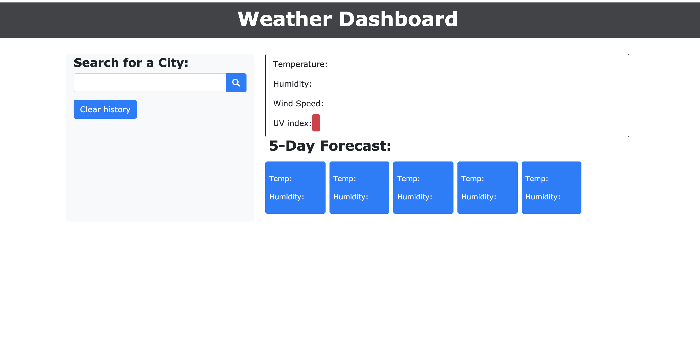

# Weather Dashboard

## Description



The challenge of this project was to build a weather dashboard that runs in the browser and features dynamically updated HTML and CSS. I used the [OpenWeather API](https://openweathermap.org/api) to retrieve weather data for cities of the user's choice. `localStorage` is used to store any persistent data.

The application finds the weather conditions in a particular city based on real time and displays the upcomming 5 day forecast. The weather displayed includes characteristics such as:

* City, date, weather icon reflecting what the day's weather is like
* Temperature (F)
* Humidity
* Wind speed
* The UV index

Local storage within the application is then used to store previous city searches, in addition to displaying them when the user clicks on the city name. The user is also given the capability to clear all search history by pressing a button.

## User Story
```
AS A traveler
I WANT to see the weather outlook for multiple cities
SO THAT I can plan a trip accordingly
```

## Acceptance Criteria
```
GIVEN a weather dashboard with form inputs
WHEN I search for a city
THEN I am presented with current and future conditions for that city and that city is added to the search history
WHEN I view current weather conditions for that city
THEN I am presented with the city name, the date, an icon representation of weather conditions, the temperature, the humidity, the wind speed, and the UV index
WHEN I view the UV index
THEN I am presented with a color that indicates whether the conditions are favorable, moderate, or severe
WHEN I view future weather conditions for that city
THEN I am presented with a 5-day forecast that displays the date, an icon representation of weather conditions, the temperature, and the humidity
WHEN I click on a city in the search history
THEN I am again presented with current and future conditions for that city
WHEN I open the weather dashboard
THEN I am presented with the last searched city forecast
```

## Demo 

<iframe src="https://drive.google.com/file/d/1No1a4hirBZ1E83uUjOmWtcCXSflNuZH3/preview" width="640" height="480"></iframe>

<br>

Following this URL, you can access and run the application: 

## Acknowledgements and Credits

* [Bootstrap](https://getbootstrap.com/)
* [Fontawesome](https://fontawesome.com/)
* [OpenWeatherDemo](http://osp123.github.io/tutorials/html/weatherAPI.html)
* [OpenWeatherGuide](https://openweathermap.org/guide)
* [API'sForBeginners](https://www.youtube.com/watch?v=GZvSYJDk-us&t=1140s)
* [W3Schools])https://www.w3schools.com/)
